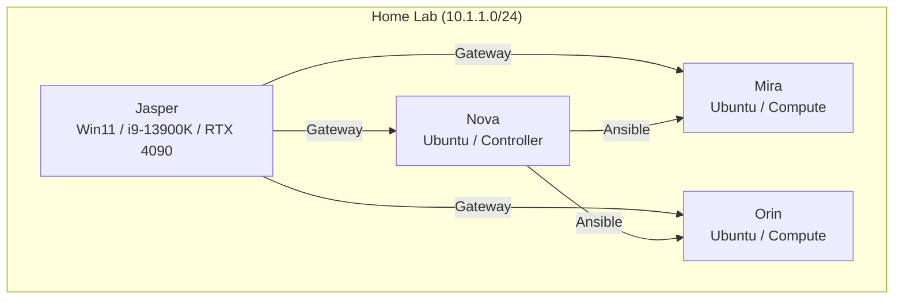

# Home Lab — Infrastructure Portfolio

> Multi-node AI inference and SRE automation cluster built by Micheal Breedlove.

## 30-Second Tour

🏗️ **What:** A 4-node homelab running local AI models with full SRE automation.

🔧 **How:** OpenClaw orchestrates AI agents, Ansible manages config, custom Python pipelines handle SLOs, incidents, chaos testing, and evidence packs.

📊 **Why:** Portfolio demonstrating infrastructure automation, site reliability engineering, security practices, and AI/ML operations.

### What I Built
- Local LLM cluster serving Qwen 2.5 32B, DeepSeek Coder v2, LLaMA 3.1 70B
- AI agent orchestration across 4 nodes with OpenClaw
- Full SRE pipeline: Chaos → Resilience → Planning → Actions → SLOs → Incidents
- Automated backups, secret scanning, and recruiter-grade documentation

### What It Demonstrates
- Site Reliability Engineering (SLOs, error budgets, incident management)
- Infrastructure as Code (Ansible, systemd, CI/CD)
- Security (secret scanning, credential policies, safety gates)
- AI/ML Operations (multi-node inference, model management)
- Documentation Discipline (architecture docs, runbooks, postmortems)

## Architecture

## Nodes
- [Jasper](nodes/jasper.md) — Windows 11 Gateway
- [Nova](nodes/nova.md) — Ubuntu Controller
- [Mira](nodes/mira.md) — Ubuntu Compute
- [Orin](nodes/orin.md) — Ubuntu Compute

## Systems
- [OpenClaw](systems/openclaw.md) — AI Agent Orchestration
- [Proxmox](systems/proxmox.md) — Virtualization
- [TrueNAS](systems/truenas.md) — Storage
- [OPNsense](systems/opnsense.md) — Firewall
- [Networking](systems/networking.md) — UniFi + Tailscale

## SRE Pipelines
- [Chaos Testing](pipelines/chaos.md)
- [SLOs + Error Budget](pipelines/slo.md)
- [Incident Commander](pipelines/incidents.md)
- [Gatekeeper](pipelines/gatekeeper.md)
- [Evidence Packs](pipelines/evidence.md)

## Reports
- [Latest SLO Report](reports/latest_slo.md)
- [Latest Incident](reports/latest_incident.md)

---
*Auto-generated by the Portfolio Publisher pipeline.*
